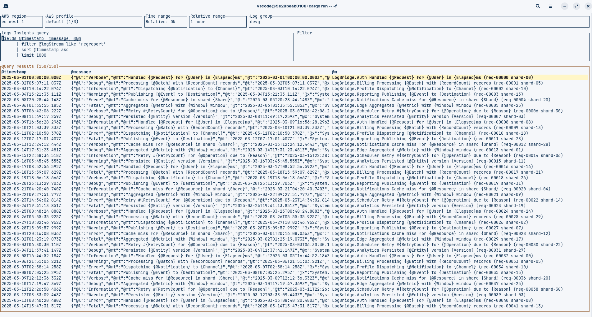
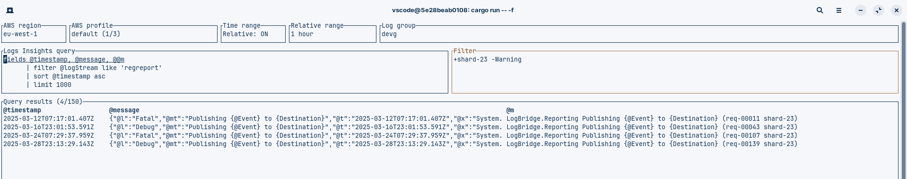
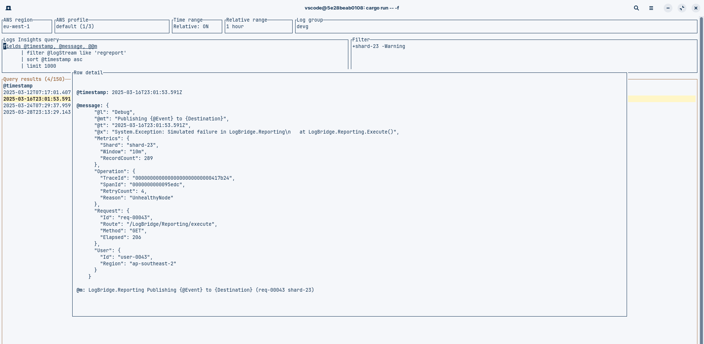
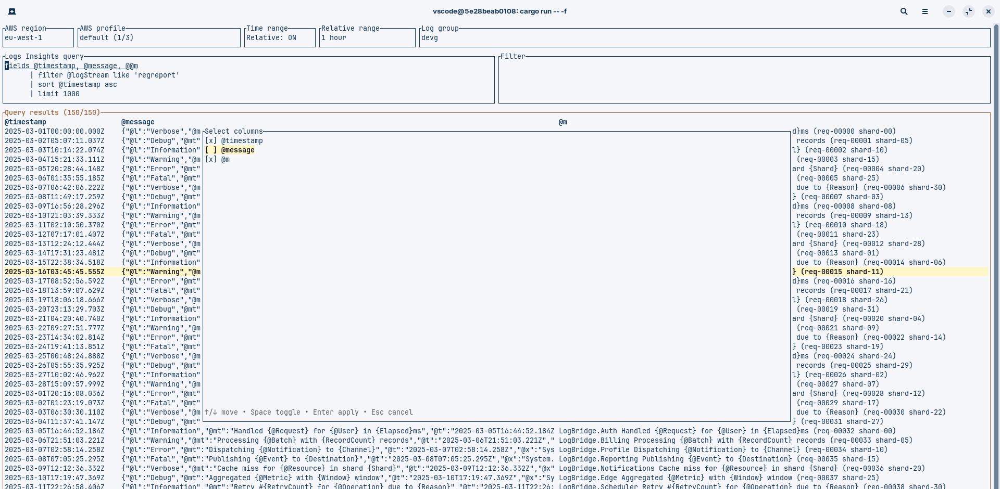
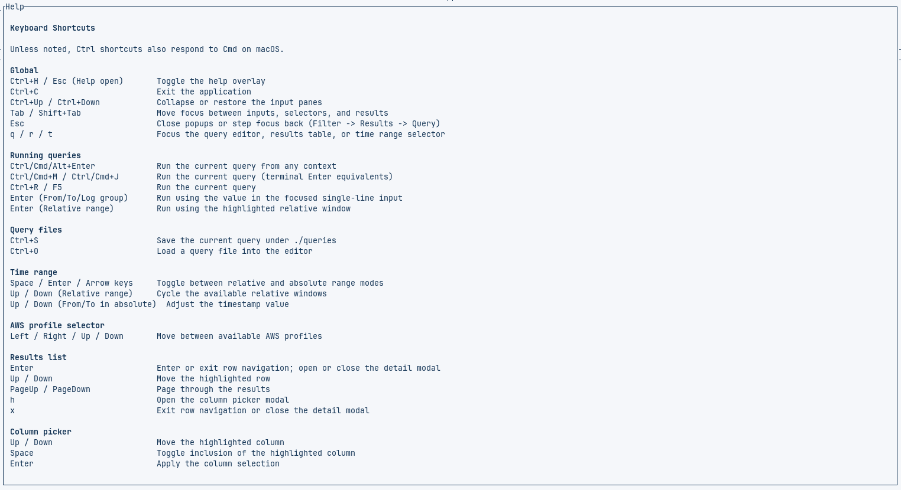

# Vibe-coded AWS Logs Insights TUI

## Execute Logs Insights queries and scroll through results

## Quick +/- based filtering

## View row details

## Select columns

## Download & Run

Grab a prebuilt binary from the [Releases](../../releases) page—only Linux and Windows builds are published for now.

Provide AWS credentials in your environment the same way you would for the AWS CLI. Use the up/down arrow keys to flip through profiles.

## Help/Key Bindings

